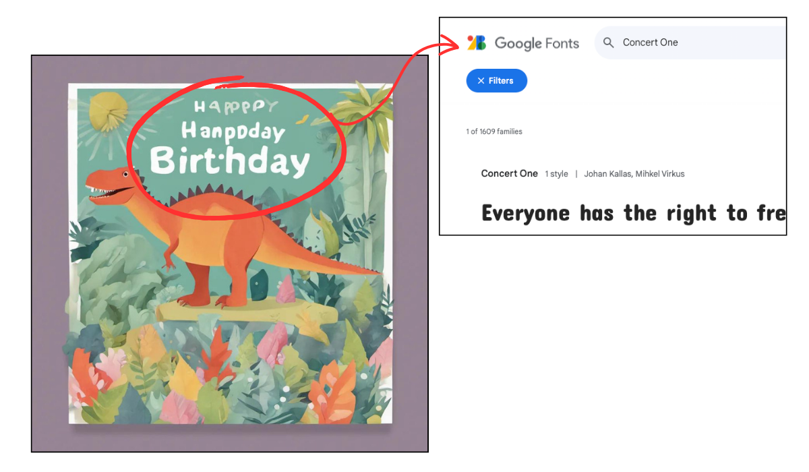
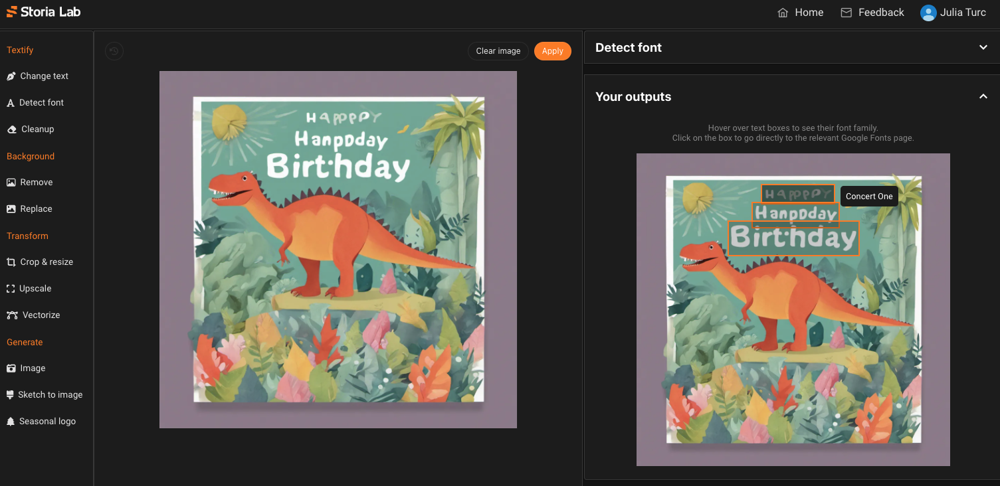

# Google Font Classifier

A lightweight classifier that, given an image with text, identifies the [Google Font](https://github.com/google/fonts) that matches it most closely. Performs well both on images with text rendered programatically and on AI-generated images.



This repository contains scripts to reproduce training dataset generation and model training, as well as our latest checkpoint that classifies ~3,000 Google fonts.

## 🚀 Try our demo
For a convenient GUI where you can upload your image and get instant predictions and direct links to the relevant Google font, head over to [Storia Lab](https://lab.storia.ai?feature=detect_font). The "Detect font" feature is free for an unlimited number of calls.



## Train your own model

### Getting started
Simply install all necessary python dependencies in a virtual environment:
```
python -m venv font-venv
source font-venv/bin/activate
pip install -r requirements.txt
```

### Generate training data
To generate training data, you will need the following resources:

1. **Background images** onto which we will overlay text. These can be any arbitrary images like photographs or graphic art. Of course, the closer they are to the images you will be handling in production, the better. We used the [COCO dataset](https://cocodataset.org/#home) (Common Objects in COntext). You can find a small sample dataset under [sample_data/backgrounds](sample_dataset/backgrounds) to use for development.

    Note that we will use these backgrounds for part of the dataset. For the other part, we use plain backgrounds. The size ratio between these two is controlled by the `--background_ratio` flag.

2. **Font files** used to render text over the background images. The names of these fonts (more precisely their filename) will be the labels of your classifier. We used nearly 3,000 fonts from the [Google Fonts](https://github.com/google/fonts) repository. We excluded some that seem defective, listed in [blacklisted_fonts.txt](blacklisted_fonts.txt). You can find a small sample font selection under [sample_data/fonts](sample_data/fonts) to use for development.

3. **Text snippets** to render. By default, the script uses sentences from Wikipedia. However, you can provide your own text by setting `--text_source=textfile` and `--textfile=/path/to/your/text/file`.

Once you have these folders in place, you can simply run:
```
python dataset_generation.py 10000 --backgrounds=/path/to/backgrounds --fonts=/path/to-fonts
```
where you can replace 10000 with the desired dataset size.

### Run training
To run training, we recommend a GPU. However, it is feasible to run on CPU as well.
```
python train.py --image_folder=/path/to/data/generated/above --output_folder=/path/where/to/place/model
```
By default, this will train a Resnet50 model, but you can easily swap a different architecture by setting the `--network_type` flag to one of the network types supported by the [timm library](https://huggingface.co/docs/timm/en/reference/models).

## Use our pretrained model
TODO(julia): Make a hf_infer.py script that calls our model on Huggingface.

## Interested in an API?
If you want a reliable API and don't want to bother hosting the model yourself, let us know at [info@storia.ai](mailto:info@storia.ai).